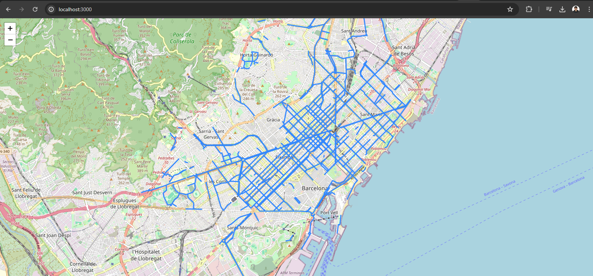

# BCN BikeLane Map



## Run

### NPM

```bash
npm install
npm run start
```

### Docker

```bash
docker build -t bikelanemap:latest .
docker run --rm -it -p 3000:3000 bikelanemap:latest
```

## Endpoints

Check the swagger for more info `http://localhost:3000/api/doc`